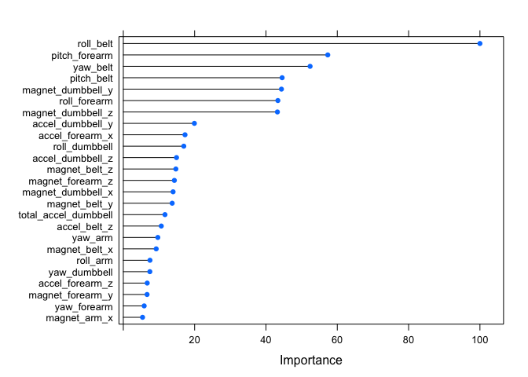
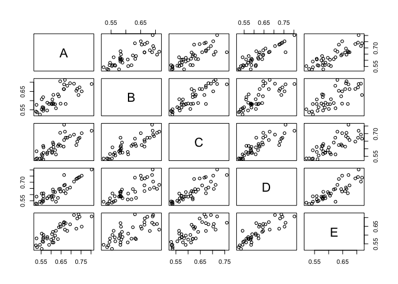

#Background
Using devices such as Jawbone Up, Nike FuelBand, and Fitbit it is now possible to collect a large amount of data about personal activity relatively inexpensively. These type of devices are part of the quantified self movement – a group of enthusiasts who take measurements about themselves regularly to improve their health, to find patterns in their behavior, or because they are tech geeks. One thing that people regularly do is quantify how much of a particular activity they do, but they rarely quantify how well they do it. 

#Goal
Goal is to use data from accelerometers on the belt, forearm, arm, and dumbell of 6 participants to predict the manner in which they did the exercise. This is the "classe" variable in the training set. We will use any of the other variables to predict with. The report describes how the model was built, how I used cross validation, what the out of sample error is. 

#Preprocessing
Load libraries and training data. Create training set with 60% of dataset. For cross-validation, we will partition testing set into 2 equal subsets.

```r
suppressWarnings(suppressMessages(library(caret)))
suppressWarnings(suppressMessages(library(randomForest)))
suppressWarnings(suppressMessages(library(rpart)))
suppressWarnings(suppressMessages(library(pROC)))
setwd("~/Coursera/Practical-Machine-Learning")

df <- read.csv("pml-training.csv", na.strings=c("NA",""), header=TRUE)
inTrain <- createDataPartition(df$classe, p=0.6, list=FALSE)
training <- df[inTrain,]
testing <- df[-inTrain,]
inSubTest <- createDataPartition(testing$classe, p=0.5, list=FALSE)
sub_testing1 <- testing[inSubTest,]
sub_testing2 <- testing[-inSubTest,]
```

The training set has 160 columns. Not all columns wil be useful since many have NA values. We will remove these columns now.

```r
training <- training[, which(as.numeric(colSums(is.na(training)))==0)]
```

We will also remove columns that are non-numerics or timestamps or near zero fractions.

```r
training <- training[,-c(1:7)]
training <- training[, -c(grep("^gyros", names(training)))]
training <- training[complete.cases(training), ]
```

#Model selection and training
We will use 2 two learning algorithms (rpart and rf) to compare accuracy and out of sample errors.

###Recursive Partitioning (rpart)

```r
modelFit_rpart <- train(classe ~ ., data=training, method="rpart")
prediction_rpart <- predict(modelFit_rpart, newdata=testing)
cfm_rpart <- confusionMatrix(prediction_rpart, testing$classe)
cfm_rpart
```

```
## Confusion Matrix and Statistics
## 
##           Reference
## Prediction    A    B    C    D    E
##          A 2032  660  631  572  221
##          B   32  490   37  216  203
##          C  161  368  700  498  384
##          D    0    0    0    0    0
##          E    7    0    0    0  634
## 
## Overall Statistics
##                                           
##                Accuracy : 0.4915          
##                  95% CI : (0.4803, 0.5026)
##     No Information Rate : 0.2845          
##     P-Value [Acc > NIR] : < 2.2e-16       
##                                           
##                   Kappa : 0.335           
##  Mcnemar's Test P-Value : NA              
## 
## Statistics by Class:
## 
##                      Class: A Class: B Class: C Class: D Class: E
## Sensitivity            0.9104  0.32279  0.51170   0.0000  0.43967
## Specificity            0.6288  0.92288  0.78219   1.0000  0.99891
## Pos Pred Value         0.4937  0.50102  0.33160      NaN  0.98908
## Neg Pred Value         0.9464  0.85032  0.88352   0.8361  0.88786
## Prevalence             0.2845  0.19347  0.17436   0.1639  0.18379
## Detection Rate         0.2590  0.06245  0.08922   0.0000  0.08081
## Detection Prevalence   0.5246  0.12465  0.26905   0.0000  0.08170
## Balanced Accuracy      0.7696  0.62284  0.64694   0.5000  0.71929
```
Accuracy of model with rpart method is 0.4914606 or 49.15 %.

Out of sample error is 0.5085394. This is the error rate when the method is used on a new data set.

###Random Forest (rf)

```r
modelFit_rf <- train(classe ~ ., data=training, method="rf", trControl = trainControl(method="cv", number=4)) 
prediction_rf <- predict(modelFit_rf, newdata=testing)
cfm_rf <- confusionMatrix(prediction_rf, testing$classe)
cfm_rf
```

```
## Confusion Matrix and Statistics
## 
##           Reference
## Prediction    A    B    C    D    E
##          A 2228   10    0    0    0
##          B    3 1500    5    1    3
##          C    0    7 1356   18    7
##          D    0    1    7 1266    7
##          E    1    0    0    1 1425
## 
## Overall Statistics
##                                           
##                Accuracy : 0.991           
##                  95% CI : (0.9886, 0.9929)
##     No Information Rate : 0.2845          
##     P-Value [Acc > NIR] : < 2.2e-16       
##                                           
##                   Kappa : 0.9886          
##  Mcnemar's Test P-Value : NA              
## 
## Statistics by Class:
## 
##                      Class: A Class: B Class: C Class: D Class: E
## Sensitivity            0.9982   0.9881   0.9912   0.9844   0.9882
## Specificity            0.9982   0.9981   0.9951   0.9977   0.9997
## Pos Pred Value         0.9955   0.9921   0.9769   0.9883   0.9986
## Neg Pred Value         0.9993   0.9972   0.9981   0.9970   0.9974
## Prevalence             0.2845   0.1935   0.1744   0.1639   0.1838
## Detection Rate         0.2840   0.1912   0.1728   0.1614   0.1816
## Detection Prevalence   0.2852   0.1927   0.1769   0.1633   0.1819
## Balanced Accuracy      0.9982   0.9931   0.9931   0.9911   0.9939
```

Accuracy of model with rf method is 0.9909508 or 99.1 %.

Out of sample error is 0.0090492.

Clearly rf method has better accuracy and way lower out of sample error rate. We will continue to use Random Forest (rf) as the learning algorithm to obtain better predictive performance and find best predictors for classe variable.

We will use variable importance evaluation function 'varImp' to assign each predictor with a separate variable importance. All measures of importance is scaled to have a maximum value of 100. 


```r
varimp <- varImp(modelFit_rf, varImp.train=FALSE)
plot(varimp, top=25)
```

 

The top 25 most important variables are:
roll_belt, pitch_belt, yaw_belt, total_accel_belt, accel_belt_x, accel_belt_y, accel_belt_z, magnet_belt_x, magnet_belt_y, magnet_belt_z, roll_arm, pitch_arm, yaw_arm, total_accel_arm, accel_arm_x, accel_arm_y, accel_arm_z, magnet_arm_x, magnet_arm_y, magnet_arm_z, roll_dumbbell, pitch_dumbbell, yaw_dumbbell, total_accel_dumbbell, accel_dumbbell_x, accel_dumbbell_y, accel_dumbbell_z, magnet_dumbbell_x, magnet_dumbbell_y, magnet_dumbbell_z, roll_forearm, pitch_forearm, yaw_forearm, total_accel_forearm, accel_forearm_x, accel_forearm_y, accel_forearm_z, magnet_forearm_x, magnet_forearm_y, magnet_forearm_z

Next we will compute area under the ROC curve for each class against the predictor. The ROC curve is essentially a plot of true positive rate against the false positive rate at various threshold settings.

```r
RocImp <- filterVarImp(x = training[, -ncol(training)], y = training$classe)
plot(RocImp)
```

 

#Model testing and cross-validation
Let us now test the models against the two testing subsets created during pre-processing.

```r
prediction1 <- predict(modelFit_rf, newdata=sub_testing1)
cfm1 <- confusionMatrix(prediction1, sub_testing1$classe)

prediction2 <- predict(modelFit_rf, newdata=sub_testing2)
cfm2 <- confusionMatrix(prediction2, sub_testing2$classe)
```

The accuracy of model against testing subset 1 is: 0.9910783 or 99.11 %. Out of sample error is 0.0089217.


The accuracy of model against testing subset 2 is: 0.9908233 or 99.08 %. Out of sample error is 0.0091767.

##References:
1. Variable Importance function: http://topepo.github.io/caret/varimp.html
2. Models available in caret: http://topepo.github.io/caret/bytag.html

#End of course project writeup
+++++++++++++++++++++++++++++++++++++++++++++

###Below code is for course project submission


```r
testFinal <- read.csv("pml-testing.csv", header=TRUE)
x <- sort(match(names(training), names(testFinal)))
testFinal <- testFinal[,x]
answers <- predict(modelFit_rf, testFinal)

pml_write_files = function(x){
  n = length(x)
  for(i in 1:n){
    filename = paste0("problem_id_",i,".txt")
    write.table(x[i],file=filename,quote=FALSE,row.names=FALSE,col.names=FALSE)
  }
}

pml_write_files(answers)
```

